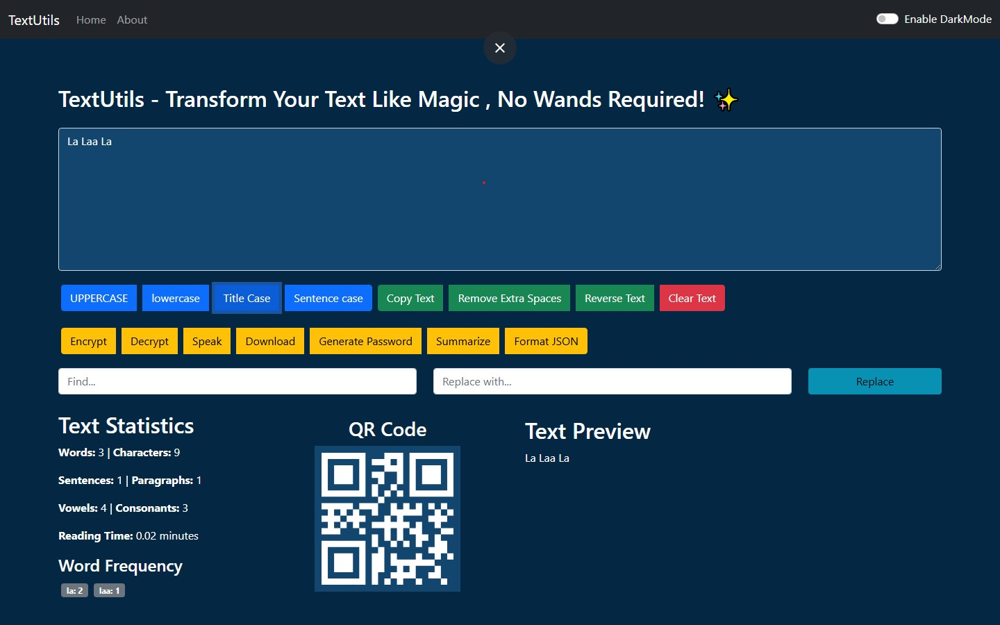

# TextUtils-React 🔠


A lightweight React application for text manipulation with various useful utilities.
<p>TextUtils-React is a handy web application built with React.js that provides various text manipulation tools. It allows users to modify their text in multiple ways, such as converting case, removing extra spaces, copying to clipboard, and more—all in a clean, user-friendly interface.</p>



## ✨ Features

### 📊 Text Analysis
- **Detailed Statistics**:
  - Word count (with/without spaces)
  - Character count
  - Sentence count
  - Paragraph count
  - Reading time estimation
  - Vowel/consonant count
  - Word frequency analysis
### 🔠 Text Transformation
- **Case Conversion**:
  - UPPERCASE conversion
  - lowercase conversion
  - Title Case formatting
  - Sentence case formatting
  - Remove extra spaces
  - Copy text to clipboard
  - Reverse text
  - Clear text completely
### ⚡ Bonus Utilities
- **Special Functions**:
  - Text encryption/decryption (Soon)
  - Password generator
  - JSON formatter/validator
  - Basic text summarization
  - Text-to-speech output
  - Download as text file
  - Find & replace functionality

### Installation
```bash
# Clone the repository
git clone https://github.com/tusharrr01/TextUtils-React.git

# Navigate to project directory
cd TextUtils-React

# Install dependencies
npm install

# Start development server
npm run start 
```

### 📜 License
- Made with ❤️ by [Tushar](https://github.com/tusharrr01)

